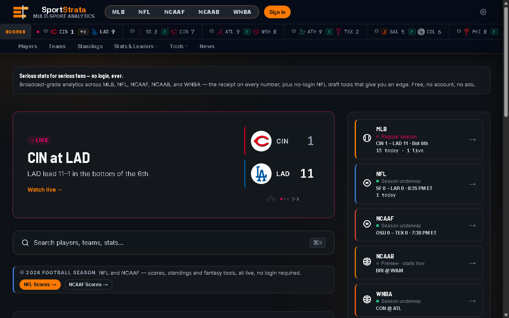

<div align="center">


# SportStrata

### Serious stats for serious fans.

[](https://sportstrata.cc)
[](https://github.com/zohnner/zohn-sports-stats/actions/workflows/ci.yml)


[](https://pages.cloudflare.com/)
[](#license)

**A free sports analytics platform, six sports deep.** MLB is the flagship —
NFL, NCAA Football, NCAA Men's Basketball, and WNBA are all live too — built
as a single vanilla JavaScript SPA with **no framework and no build step**.
Every core feature works fully signed-out, forever; an optional free account
adds cross-device sync, never a login wall. Content pages are edge-prerendered
on Cloudflare so the site is fully indexable by search and AI crawlers.

**[sportstrata.cc →](https://sportstrata.cc)**

<br>



<sub>A live capture of the actual home page — not a mockup.</sub>

</div>

---

### Contents

[What it is](#what-it-is) · [MLB](#mlb) · [NFL](#nfl-public-beta) ·
[NCAA Football](#ncaa-football-live) · [NCAA Men's Basketball](#ncaa-mens-basketball-live) ·
[WNBA](#wnba-live) · [Accounts & follows](#accounts--follows-optional-d-031) ·
[Intelligence without metered inference](#intelligence-without-metered-inference) ·
[SEO & discoverability](#seo--discoverability) · [Tech stack](#tech-stack) ·
[Getting started](#getting-started) · [Project structure](#project-structure) ·
[Development](#development) · [Deployment](#deployment) · [License](#license)

---

## What it is

**MLB** is the primary product, live all season with the deepest feature set.
Five more sports sit alongside it: **NFL** (public beta, year-round fantasy
draft tools), **NCAA Football**, **NCAA Men's Basketball**, and **WNBA** are
all live surfaces with real feature work; **NBA** and **NHL** stay
preview-only. No paywall, no ads, and every core feature works fully
signed-out — an optional free account (D-031) just adds cross-device sync for
followed teams and players. Every computed number shows its provenance — "the
receipt" — so broadcast professionals can trust and cite it.

- **MLB** — primary product, full depth.
- **NFL** — public beta: live scores/standings/teams in season, historical stat
  leaders back to 2000, Next Gen Stats, a no-login Mock Draft simulator + Draft
  HQ, and a Pick'em Confidence Helper.
- **NCAA Football** — live: scores (offseason-aware), AP/Coaches/CFP rankings,
  conference-grouped standings and teams, player leaders/detail, and a live
  game viewer with a projected-perspective field-position graphic.
- **NCAA Men's Basketball** — live: scores (offseason-aware), AP/Coaches
  rankings, conference-grouped standings and teams, and a live game viewer.
- **WNBA** — live: scores (offseason-aware), standings, teams, statistical
  leaders + player detail, a live/final game panel, and a Playoff Picture.
- **NBA / NHL** — preview only (accessible, no active feature work).

### At a glance

| Sport | Status | Scores | Standings & Teams | Rankings / Leaders | Player detail | Live game viewer |
|---|:---:|:---:|:---:|:---:|:---:|:---:|
| ⚾ MLB | Primary | ✅ | ✅ | ✅ | ✅ | ✅ |
| 🏈 NFL | Public beta | ✅ | ✅ | ✅ | ✅ | ✅ |
| 🏈 NCAA Football | Live | ✅ | ✅ | ✅ | ✅ | ✅ |
| 🏀 NCAA Men's Basketball | Live | ✅ | ✅ | ✅ *(no leaders yet)* | — | ✅ |
| 🏀 WNBA | Live | ✅ | ✅ | ✅ *(no poll — no Rankings)* | ✅ | ✅ |
| 🏀 NBA | Preview | — | — | — | — | — |
| 🏒 NHL | Preview | — | — | — | — | — |

---

## MLB

The deepest surface on the site — everything below ships today.

<details open>
<summary><b>Show MLB feature breakdown</b></summary>

### Players & leaderboards
- Hitters and pitchers with client-computed advanced rates (ISO, BABIP, FIP,
  K-BB%, wOBA, wRC+); position filter, favorites, recently viewed.
- Leaderboards across hitting and pitching, plus Statcast leaderboards (xBA,
  xSLG, xwOBA, EV, Barrel%, HH%, Whiff%, CSW%, K%, BB%).
- League-rank badges on individual player stats (top-30 MLB).

### Player detail
- Season stats + computed advanced rates; Statcast percentile card (Baseball Savant).
- Pitch arsenal for pitchers; career year-by-year table with trend chart.
- Splits (L/R, Home/Away, L7/L14/L30, month-by-month); spray chart; H2H matchup card.
- Two-player side-by-side compare (stat bars, radar overlay, shareable URL).

### Game prep (broadcast)
- Probable-pitcher cards, team batting/pitching comparison, handedness splits,
  park factor, key hitters, bullpen tracker, weather, and pitcher-vs-team history.
- Printable game-prep sheet (`⌘P`).

### Scores, live games & scorecard
- Date navigation, linescore, box score, probable pitchers.
- Live Game expanded view — diff-based linescore polling, play-by-play, box score.
- Baseball Scorecard — interactive historical + live modes, PNG export.

### Teams & standings
- Team drill-down — roster, aggregate stats, upcoming schedule, IL status, and a
  **Playoff Odds** hero stat.
- Standings with L10 form, run differential, power rankings, magic numbers, and
  **October Odds** (DIV% / OCT%).

### Playoff odds, Ask bar & intelligence without metered inference
- **October Odds** — client-side Monte Carlo (4,000 simulated seasons) division
  and playoff odds, updated daily; surfaced on standings, team detail, and the home page.
- **Ask bar (⌘K)** — natural-language stat queries ("hr leaders", "dodgers ops",
  "era leaders min 50 ip") answered by a deterministic grammar over the stat
  engine — instant, no model, zero inference cost.
- **Stat Builder** — custom stat formulas (math.js, lazy-loaded).
- **Shareable stat cards** — branded 1200x630 PNG cards for any leaderboard stat.

</details>

---

## NFL (public beta)

<details open>
<summary><b>Show NFL feature breakdown</b></summary>

- **Season-aware home** — draft-season hero with a kickoff countdown in the
  offseason; live gameweek in season.
- **Scores, standings, teams** — live from ESPN; multi-season.
- **Stat leaders back to 2000** (ESPN) and **Next Gen Stats, 2016+** (nflverse).
- **Player & team pages** — profiles, season stats, game logs, advanced metrics.
- **Draft HQ** — rankings, a VORP-based value board (rookie-inclusive,
  market-implied projections), tiers, and strength-of-schedule.
- **Mock Draft simulator** — no-login snake draft against ADP-based AI opponents,
  Monte Carlo pick-survival, roster grade, Superflex (Sleeper ADP data).
- **Pick'em Confidence Helper** — ranks the week's games by blended win
  probability (DraftKings odds devigged + ESPN's independent model),
  flagging games where the two disagree — a decision aid for real confidence
  pick'em pools, not a betting product.

The NFL season model auto-rolls every year — no hardcoded season in client copy.

</details>

---

## NCAA Football (live)

- **Scores** — offseason-aware, live from ESPN college-football, with a live
  game viewer (tabbed dashboard + a projected-perspective field-position
  graphic — ball marker, first-down line, red zone, play-arrow trajectory).
- **Rankings** — AP, Coaches, and CFP polls.
- **Standings & Teams** — conference-grouped, live from ESPN, with a
  find-a-team filter and conference jump nav.
- **Player leaders & detail** — season stat groups, game log, game-trend
  chart, and a Season Profile radar normalized against the FBS leader.

---

## NCAA Men's Basketball (live)

- **Scores** — offseason-aware, live from ESPN, with a live game viewer.
- **Rankings** — AP and Coaches polls.
- **Standings & Teams** — conference-grouped, live from ESPN.
- Player leaders/detail not yet built (data-checked as viable).

---

## WNBA (live)

- **Scores** — offseason-aware (Apr–Oct season), live from ESPN, with a
  live/final game panel (season-context stats alongside live score/status).
- **Standings & Teams** — flat Eastern/Western conference standings (no
  divisions).
- **Leaders & player detail** — PPG/RPG/APG/SPG/BPG/FG%/FT% leaderboards with
  full player profiles.
- **Playoff Picture** — a standings-derived top-8-overall snapshot ("if the
  season ended today"), not a per-conference bracket.
- No Rankings — there's no poll for a pro league.

---

## Accounts & follows (optional, D-031)

A free account is entirely additive — every page works fully signed-out exactly
as before. Signing in (passkey, Google, or magic link) adds one thing: your
followed teams and players sync across devices instead of staying in
`localStorage` on one browser. The follow star (`renderFollowStar()`) is the
one favorite/follow control across every sport that has it — MLB, NFL, NCAAF,
NBA, and WNBA cards and detail pages all use it (NCAAB isn't wired in yet). No
paywall sits behind an account; it's sync, not a gate.

---

## Intelligence without metered inference

"AI" ships from three free places (see `DECISIONS.md` D-039), so nothing meters
per user action and one viral day never decides the bill:

1. **Authoring time** — generated in subscription-covered sessions, committed as static data.
2. **Training time** — models fit offline, shipped as coefficient JSON evaluated client-side.
3. **Client time** — the user's own compute (Monte Carlo, the Ask-bar grammar).

Shipped today: the Ask bar and October Odds. On the roadmap: trained
rest-of-season projections and player-similarity comps.

---

## SEO & discoverability

The app is a hash-routed SPA, but key content is **also served at real,
crawlable path URLs** via Cloudflare Pages Functions that return prerendered
HTML (title, description, canonical, JSON-LD, and a content snapshot) to every
client, then hydrate into the SPA for humans — no user-agent sniffing.

- `/mlb/team/{abbr}` · `/mlb/player/{id}/{slug}` · `/mlb/standings` ·
  `/mlb/game/{pk}` · `/mlb/leaders` (edge-prerendered)
- `/nfl`, `/ncaaf`, `/ncaab`, `/wnba` sport landings, plus team/player/game
  content templates for NFL and NCAAF and standings/leaders for NCAAB/WNBA
- Static landing pages: `/mock-draft`, `/draft-kit`, `/playoff-odds`, `/ask`, `/pickem`
- `sitemap.xml` (auto-refreshed daily via GitHub Actions), `robots.txt`,
  per-page 1200x630 Open Graph cards (a real edge-rendered PNG via satori for
  some pages, a shared static default elsewhere), and JSON-LD (`Organization`,
  `WebSite`, `SportsTeam`, `Person`, `Dataset`).

---

## Tech stack

| Layer | Choice |
|---|---|
| Frontend | Vanilla JS / HTML / CSS — ES2022+, no framework, no build step |
| Routing | Hash-based SPA + edge-prerendered path URLs |
| Charts | Chart.js 4 |
| Math | math.js (Stat Builder, lazy-loaded) |
| Export | html2canvas (scorecards, share cards; dynamic load) |
| Hosting | Cloudflare Pages + Pages Functions |
| Edge cache | Cloudflare D1 (MLB Stats API / Savant proxy) |
| Offline | Service worker (`sw.js`) — SWR for assets, network-first for navigation |

### Data sources
- **MLB Stats API** (`statsapi.mlb.com`) — free, no key.
- **Baseball Savant** — Statcast percentiles, leaderboards, arsenals.
- **ESPN public API** — NFL scores/standings/teams/stats; NBA/NHL preview.
- **Sleeper** — NFL players, ADP, trending (`/api/sleeper`).
- **nflverse** (CC-BY-4.0) — NFL Next Gen Stats.
- **Open-Meteo** — game-prep weather.

No secret ever lives in committed source; provider keys go through Cloudflare
Worker/secrets.

---

## Getting started

No build step. Serve the folder with any static server for the MLB surface:

```bash
npx serve .
# or
python -m http.server 3001
```

MLB features work with **zero configuration** — the MLB Stats API is free and
keyless. The NFL surface reads through the `/api/*` Pages Functions
(ESPN / Sleeper / nflverse), so to exercise it locally run it under Pages:

```bash
npx wrangler pages dev .
```

---

## Project structure

```
/
├── index.html                 # SPA shell — script load order, 3-row header, CSP meta
├── sw.js                      # Service worker (versioned cache; bump per deploy)
├── _headers                   # Cloudflare Pages — CSP + security headers (mirror index.html CSP)
├── manifest.json              # PWA manifest
├── sitemap.xml / robots.txt   # SEO
├── mock-draft.html · draft-kit.html · playoff-odds.html · ask.html · pickem.html   # static SEO landing pages
├── css/                       # variables (tokens) · main · components · ticker · animations
│                              #   scorecard · liveGame · shareCard · nflStandings · nflLiveGame · nflPickem · arcade · auth
├── js/
│   ├── config · detailFrame · errorHandler · cache · schema · api · glossary   # core + AppState + utilities
│   │                          #   detailFrame = shared cross-sport player/team detail chrome (D-044)
│   ├── mlb · odds · scorecard · liveGame · shareCard · statBuilder · query   # MLB surface + October Odds + Ask bar
│   ├── nfl · nflLiveGame · nflStandings · fantasy · nflPickem · sos   # NFL surface + Mock Draft, Draft HQ, Pick'em
│   ├── ncaaf · ncaafLiveGame                                     # NCAA Football — scores/rankings/standings/teams/leaders + live viewer
│   ├── ncaab                                                     # NCAA Men's Basketball — scores/rankings/standings/teams
│   ├── wnba · bballLiveGame                                      # WNBA — scores/standings/teams/leaders/playoff picture;
│   │                          #   bballLiveGame = shared live-game viewer for NCAAB + WNBA
│   ├── players · leaderboards · teams · games · playerDetail     # NBA preview
│   ├── nhl · arcade · news · scorebug · charts · standings · db  # NHL preview, arcade, shared scorebug (D-047)
│   ├── auth                                                      # accounts (D-031) — optional, additive; owns
│   │                          #   the unified follow star used across every sport that has one
│   ├── search · navigation · app                                 # ⌘K, routing/sport switch, bootstrap
│   └── math.min.js                                               # vendored (lazy-loaded by Stat Builder)
├── functions/
│   ├── api/                   # Pages Functions: mlb, nfl, ncaaf, ncaafstandings, ncaafstats, ncaafathlete,
│   │                          #   ncaab, ncaabstandings, wnba, wnbastandings, wnbastats, wnbaathlete,
│   │                          #   sleeper, nflstats, nfladv, nflplayer, nflgamelog, nflcareer, nflstandings,
│   │                          #   nflsos, nflsearch, news, og (dynamic OG-image renderer),
│   │                          #   auth/[[route]] (better-auth), follows, prefs, me …
│   │                          #   (_middleware.js rate-limits /api/*)
│   ├── mlb/                   # edge-prerender routes: team/[abbr], player/[id]/[[slug]], standings, game/[pk], leaders
│   ├── nfl/, ncaaf/           # edge-prerender sport landings + team/player/game content templates + pickem
│   ├── ncaab/, wnba/          # edge-prerender sport landings + standings (WNBA also: leaders, player)
│   ├── _og.js                 # shared satori-based OG-image renderer (D-128)
│   └── index.js               # edge-prerendered home page
├── worker/                    # Cloudflare Workers (bdl-proxy; wrangler-auth-purge.toml = D-031 daily session/audit_log purge;
│                              #   push-game-alerts.js = Web Push game-start alerts)
├── migrations/                # D1 schema — accounts/follows/prefs, live (D-031, shipped 2026-08)
├── tools/                     # check-manifest · check-themes · join-health · gen-sitemap (the /deploy-check suite)
├── tests/                     # node --test: stats · odds · query · vbd
├── bot/                       # Python: tweets stat combos, weekly digest, review-first content-queue drafts
│                              #   (server-side only, no client-side dependency on any of this)
└── assets/                    # icons, OG cards, theme images
```

Deeper docs live at the repo root: `CLAUDE.md` (architecture + conventions),
`DESIGN.md` (house style), `DECISIONS.md` (ADR log), `GOALS.md`, `ISSUES.md`.

---

## Development

- **Tests:** `node --test tests/stats.test.js tests/odds.test.js tests/query.test.js tests/vbd.test.js`
- **Pre-deploy:** run the `tools/` checks (delivery-manifest sync, theme contrast,
  name-join health) — bundled as the `/deploy-check` routine. Never add a JS/CSS
  file without adding it to **both** `index.html` and `sw.js`.
- **Adding an external domain** requires updating **both** the CSP `<meta>` in
  `index.html` and `_headers`.
- Bump `CACHE_NAME` in `sw.js` on every deploy so returning clients get fresh code.

---

## Deployment

Hosted on **Cloudflare Pages** (static assets + Pages Functions).

1. Push to GitHub; Cloudflare Pages builds automatically.
2. Build command: *(none)*; output directory: `/`.
3. `_headers` applies CSP and security headers; `functions/` deploy as Pages Functions;
   the MLB edge cache uses a D1 binding (`DB`); accounts/follows/prefs (D-031) use a
   separate D1 binding (`USER_DB`), added via the Pages dashboard — see the comment
   at the top of `wrangler.toml`.

---

## License

[MIT](LICENSE)
